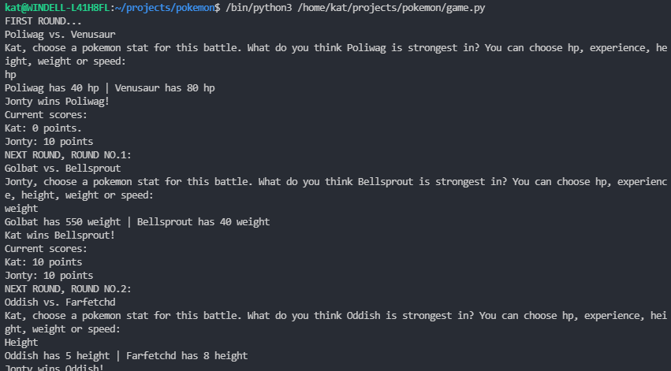
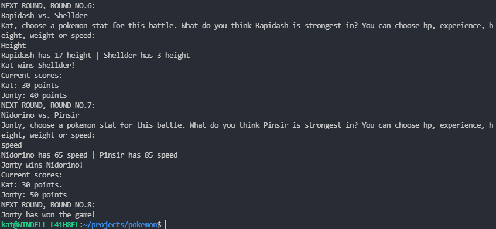

# Pokemon Top Trumps Game

**Python | Pytest**

After completing CodeFirstGirls Python Kickstarter course, I created a Top Trumps Pokemon game for two players that runs on the command line, requesting data from the PokeAPI. I undertook this part-time (16hr) course whilst in full-time work, before joining the Makers bootcamp. After learning best practices and principles through Makers, I recognise there are many improvements to be made in my Pokemon Top Trumps code! I have not had time to implement these improvements yet, although I have made sure my code is fully-tested using Pytest, which is not something I learnt on the Python Kickstarter course.

Improvements I would like to make include: 
- Game class is responsible for far too much! I need to separate out responsibilities more carefully between Player, Game, Pokemon and Deck
- Mocking within Pytest
- Add more """ """ comments to explain what each class and function is responsible for

### To run the game:

1. Launch your environment e.g.

```
$ Pipenv shell
```

2. Install dependencies listed in the pipfile (using Pip or Pipenv) e.g.

```
$ Pipenv install
```

3. Run the game on the command line:

```
$ python3 game.py
```

### To run the tests:

After installing project dependencies as in the above instructions (using pip or pipenv)

```
$ Pytest

```

### Screenshots of the game running on the command line



